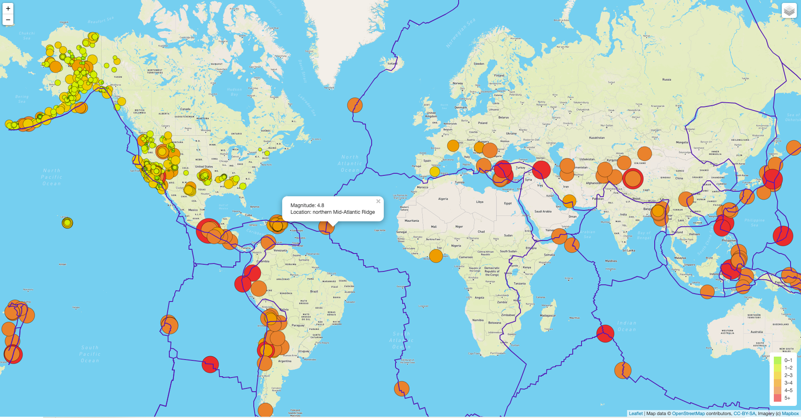

# Mapping_Earthquakes

### Challenge

I created a map that that illustrates the relationship between the tectonic plates and the location and frequency of earthquakes that have occured in the past 7 days. 

Users can switch between 3 different map styles as well as turn on and off the Tectonic Plates and/or the Earthquake data.

### Webpage Screenshot

### Coding Languages Used
- JavaScript
- HTML
- CSS

